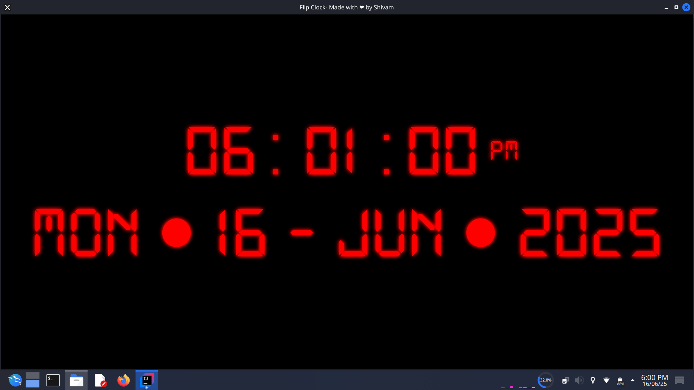

# Flip Clock

This project is a simple flip clock application.

To get started, follow these steps:

## Importing into IntelliJ IDEA

1.  Open IntelliJ IDEA.
2.  Select `File` > `Open`.
3.  Navigate to the directory where you cloned this repository and select the `pom.xml` file.
4.  IntelliJ will prompt you to import the project as a Maven project. Confirm this.

## Running the Application

1.  Once the project is imported, navigate to `src/main/java/com/example/flipclock/flipclock/HelloApplication.java`.
2.  Right-click on the `HelloApplication.java` file.
3.  Select `Run 'HelloApplication.main()'` from the context menu.

Enjoy your flip clock! 
